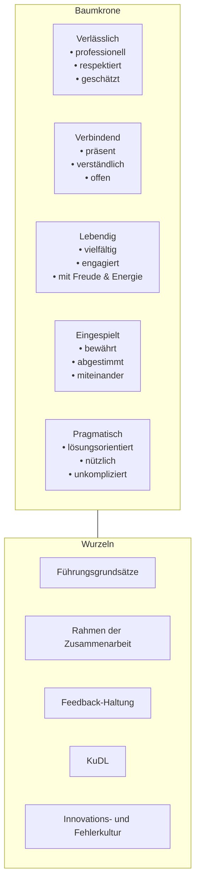
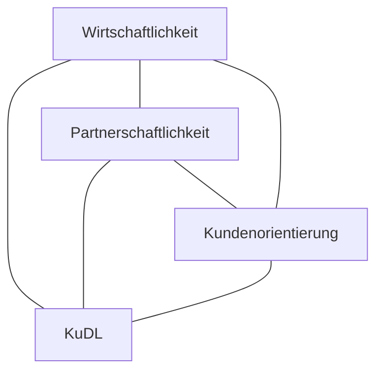
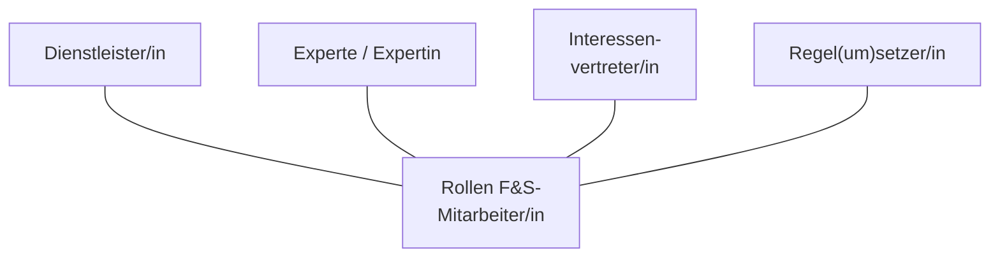

Zürcher Hochschule für Angewandte Wissenschaften

# zh aw Finanzen & Services
# <u>F&S Baumstark</u>

The page features a large graphic of a stylized green tree with roots. The leaves of the tree contain various photographs depicting teamwork, balance, and physical activity:
*   Top leaf: Two people reaching out to each other against a blue sky.
*   Left middle leaf: Construction workers on a steel beam.
*   Right middle leaf: Four people jumping joyfully in an outdoor setting.
*   Bottom left leaf: A person's legs walking across stepping stones in water.
*   Bottom right leaf: A team of people rowing a dragon boat.

The background consists of faint, overlapping leaf patterns in light green.

Zürcher Fachhochschule www.zhaw.ch

# Inhaltsverzeichnis

...........................

Vorwort ............................................................ 3

Setzungen F&S ................................................ 4

I. F&S Baumstark – Übersicht ......................... 6

II. F&S Baumstark – Die Wurzeln ..................... 9
* Führungsgrundsätze ............................... 11
* Rahmen der Zusammenarbeit ................. 13
* Feedback-Haltung .................................. 15
* Innovations- und Fehlerkultur .................. 17
* Kunden- und Dienstleistungs-
orientierung F&S (KuDL) .......................... 19

III. F&S Baumstark – Der tragende Stamm ....... 22

IV. F&S Baumstark – Die Blätter der Baumkrone 23
* Eingespielt ............................................. 25
* Lebendig ................................................ 27
* Verlässlich .............................................. 29
* Verbindend ............................................. 31
* Pragmatisch ........................................... 33

Persönliche Notizen .......................................... 34

# Vorwort

...........................

Liebe Mitarbeitende

Die Arbeitswelt befindet sich im Wandel. In Zeiten der Veränderung sind inhaltliche Setzungen, gemeinsame Grundhaltungen und Werte besonders wichtig. Es freut uns daher, mit F&S Baumstark Orientierung zu bieten.

Mit Mission Statement, Vision, strategischen Leitlinien, Handlungsprinzipien und Qualitätsverständnis sind unser Kernauftrag sowie die Leitplanken für unsere Weiterentwicklung definiert.

Wir sind überzeugt, dass wir mit **F&S Baumstark** einen hilfreichen Rahmen für ein erfolgreiches Wirken im Alltag wie auch für unsere Weiterentwicklung setzen. Er stärkt uns beim Erbringen professioneller Services und entspricht unserem Anspruch, uns kontinuierlich zu verbessern.

5. Auflage, Winterthur,
Januar 2022

Reto Schnellmann
Für das Leitungsteam Finanzen & Services
Reto Schnellmann, Verwaltungsdirektor ZHAW

2 3

# Setzungen F&S

***

## Mission Statement

Als F&S erbringen wir gemeinsam zeitgemässe lehr-, forschungs- und managementunterstützende Dienstleistungen in den Bereichen Hochschulbibliothek, Facility Management, Human Resources, Finanzen & Controlling, Information & Communication Technology und Campus Life.

## Vision

- Wir sind dank hochschuladäquaten, innovativen und zuverlässigen Services der Dienstleister und partnerschaftliche Zukunftsgestalter für unsere Anspruchsgruppen an der ZHAW.

## Strategische Leitlinien

- **Service-Management – nachhaltig nutzenstiftende Services anbieten**
Mit einem F&S-weiten und systematischen Service-Management erzielen wir eine hohe Dienstleistungs- und Kundenorientierung.

- **Digitalisierung – Dienstleistungen optimieren und digitale Transformation unterstützen**
Durch zeitgemässe Services und automatisierte Prozesse unterstützen wir die Hochschule sowie die Bereiche Bildung und Forschung bei der digitalen Transformation.

- **Innovationen realisieren**
Wir erzielen mit unserer auf die Anspruchsgruppen und Umweltentwicklungen abgestimmten agilen Vorgehensweise rasch und nachhaltig Kundennutzen.

- **Personal-/Kompetenzentwicklung – Zukunftsfähigkeit sichern**
Mit einem systematischem Kompetenzmanagement erhöhen wir unsere Handlungsfähigkeit und Wirkung.
Wir pflegen und entwickeln unsere F&S-Kultur so, dass wir fokussiert, zielorientiert und ergebnisoffen zusammen arbeiten.

- **Führungskultur – agile und effektive Führung leben**
Wir definieren verbindliche Zielbilder und delegieren Entscheidungskompetenzen, um Entscheidungsprozesse zu beschleunigen.
Wir setzen auf Commitment und schenken Vertrauen.

- **Prozesse und Aufbauorganisation – Geschäftsprozesse beschleunigen und Aufbauorganisation adaptieren**
Wir optimieren Prozesse und Schnittstellen, um unsere Serviceerbringung zu verbessern.
Die Aufbauorganisation evaluieren und optimieren wir regelmässig.

## Handlungsprinzipien

- **Fokus auf raschen Kundennutzen**
Wir fokussieren uns auf die Kernfunktionen und liefern rasch einen Nutzen.

- **Stop starting, start finishing**
Wir beenden unsere laufenden Vorhaben, bevor wir neue beginnen.

- **Wir setzen klare Rangfolgen**
Wir priorisieren unsere Vorhaben und konzentrieren uns auf die wichtigeren Vorhaben.

- **Disagree but commit**
Wir äussern im Entscheidungsprozess unsere Meinung und tragen auch bei einem Dissens den Entscheid mit.

- **Reduce to the max**
Wir legen den Fokus auf das Wesentliche und streben richtige und gute Lösungen an.

- **Good enough for now, safe enough to try**
Wir erarbeiten funktionierende Lösungen, die einen Mehrwert bringen und entwickeln diese bei Bedarf weiter.

## Qualitätsverständnis

F&S erfüllt den Bedarf der Anspruchsgruppen mit nachhaltigen Services unter Berücksichtigung der Standards der Profession, der zur Verfügung stehenden Ressourcen und der regulatorischen Grundlagen.
Dienstleistungsorientiertes und reflektiertes Handeln auf allen Stufen (F&S, Abteilung, Team, Stelle) bildet die Basis für kontinuierliche Verbesserungen.

4 5

# I. F&S Baumstark – Übersicht

***

## Eine Organisation benötigt Orientierung

Eine wirkungsvolle Organisation braucht ein gemeinsames Verständnis und klare Regeln für eine ausgewogene Entwicklung und ein erfolgreiches Wachstum.

***

## ... die Wurzeln

- Mit den **Führungsgrundsätzen** legen wir fest, wie wir in F&S führen sowie Klarheit und Orientierung geben.
- Eine wichtige Grundlage ist der **Rahmen der Zusammenarbeit**, der den persönlichen Umgang miteinander definiert.
- Mit den kulturellen Aspekten zu **Feedback und Fehler** schaffen wir das Fundament, um aus unserer Arbeit zu lernen, uns weiter zu entwickeln und laufend zu verbessern.
- In unserer **Kunden- und Dienstleistungsorientierung (KuDL)** beschreiben wir, wie wir als F&S-Angehörige mit unseren Kunden zusammenarbeiten.

Die Wurzeln geben uns Halt und sind unsere vitale Basis. Sie ermöglichen uns ein gesundes Wachstum und eine Weiterentwicklung.

***

## ... der tragende Stamm

- Wir alle bilden den Baumstamm und die Baumkrone mit den zahlreichen Ästen und Gabelungen: Jede und jeder einzelne Mitarbeitende, jedes Team und jede Abteilung.

***

## ... die Blätter der Baumkrone

Die nachstehenden Blätter charakterisieren die folgenden Leitworte:

- **Eingespielt** – Die einzelnen Teile eines Baumes wie Wurzeln, Stamm, Äste, Zweige und Blätter gedeihen miteinander und füreinander.
- **Lebendig** – Ein Baum lebt, neue Äste und Zweige wachsen, Knospen und Früchte entstehen. Wir entwickeln uns weiter und verändern uns.
- **Verlässlich** – Ein gesunder Baum trägt verlässlich Früchte.
- **Verbindend** – Der Baum ist mit seiner Umgebung verbunden und ist so ein prägendes Merkmal des sichtbaren Ganzen.
- **Pragmatisch** – Der Baum wächst und gedeiht situationsgerecht. Seine Wurzeln und Äste umgehen Steine und Hindernisse und lassen sich vom Wachstum nicht abhalten. Er wiegt sich im Winde und hält mit seinem starken Stamm sogar Stürmen stand.

**Wir wollen diese Wurzeln und Leitworte von F&S leben und sie in unsere tägliche Arbeit integrieren. So können wir gute Leistungen erbringen, arbeiten mit Begeisterung und Spass zusammen und entwickeln uns mit Freude und Energie weiter.**

***

6 | 7

# II.
# Die Wurzeln

...........................

***

An illustration of a stylized tree is shown on the right side of the page. The tree has a light green trunk and branches, with leaves that contain various photographs:
*   A photograph of people working on a construction project.
*   A photograph of two people reaching out to each other.
*   A photograph of a group of people jumping in the air.
*   A photograph of people rowing a boat.
*   A photograph of someone walking on stepping stones.

The tree has a dark green root system extending below a horizontal line, representing the ground.

8 9

# Führungsgrundsätze

...........................

Die Orientierung an den Führungsgrundsätzen unterstützt uns, eine agile und effektive Führung wahrzunehmen.

**Wir geben Orientierung, indem wir ...**
- zur Sinnhaftigkeit und Identifikation beitragen
- Zukunftsbilder entwickeln und Ziele konsequent verfolgen
- gegenseitige Erwartungen klären, vereinbaren und erfüllen
- Grundsätze und Regeln definieren und uns für deren Einhaltung einsetzen.

**Wir sorgen für Entscheidungen, indem wir ...**
- Entscheidungsstrukturen und -prozesse gestalten und reflektieren
- gegenseitig Vertrauen schenken und Entscheidungskompetenzen übertragen
- Entscheidungen treffen und einfordern
- priorisieren und uns auf Wesentliches konzentrieren.

**Wir organisieren Zusammenarbeit, indem wir ...**
- Kollaborationsformen gestalten und reflektieren
- uns mit anderen vernetzen und den Austausch suchen
- Konflikte frühzeitig ansprechen und zu deren Lösung beitragen.

**Wir sorgen für Entwicklung, indem wir ...**
- auf Kompetenzen und Potentiale fokussieren und die Interessen der Mitarbeitenden berücksichtigen
- uns in unterschiedlichen Rollen gegenseitig unterstützen
- uns gegenseitig Feedback geben.

11

# Rahmen der Zusammenarbeit

................................

Ein gemeinsames Verständnis zur Zusammenarbeit erleichtert ein zielführendes und konstruktives (Zusammen)Arbeiten.

1. **Wir handeln proaktiv und orientieren uns an der Zukunft.**
    - Wir klären Ziele, Rollen und Erwartungen.
    - Wir probieren aus und wagen Neues.
    - Wir suchen den Austausch, informieren und unterstützen uns gegenseitig.

2. **Wir sind verbindlich.**
    - Wir halten uns an Vereinbarungen und können uns aufeinander verlassen.
    - Wir stehen zu gemeinsam getroffenen Entscheidungen und tragen diese mit.
    - Wir übernehmen Verantwortung für unser Handeln.

3. **Wir diskutieren offen und wertschätzen uns.**
    - Wir respektieren andere Haltungen und Werte.
    - Wir hören aktiv zu und lassen uns ausreden.
    - Wir geben Feedback und sprechen Anerkennung aus.
    - Wir sprechen positive wie negative Themen direkt an.

4. **Wir gehen Spannungen und Konflikte konstruktiv an.**
    - Wir suchen den persönlichen Austausch und fragen bei Unklarheiten nach.
    - Wir handeln sachorientiert und verbalisieren unsere Emotionen.
    - Wir verstehen Konflikte als Lernfelder für unsere Entwicklung.

13

# Feedback-Haltung

● ● ● ● ● ● ● ● ● ● ● ● ● ● ● ● ● ● ● ● ● ● ● ● ●

**Feedback hilft uns Wahrnehmungen und Verhalten zu (er-)klären und die Zusammenarbeit zu verbessern. In einem Feedbackgespräch gewinnt eine Person Kenntnis darüber, wie ihr Verhalten und ihre Arbeit von anderen wahrgenommen, verstanden und erlebt werden. Es bietet allen beteiligten Personen die Möglichkeit zur Weiterentwicklung.**

**Rückmeldungen im Alltag bezeichnen wir bei F&S nicht als Feedbackgespräche. Feedbackgespräche sind organisiert und vorbereitet.**

---

# Fairness im Feedbackgespräch

Damit ein Feedbackgespräch möglichst nützlich ist, sollten einige Grundregeln befolgt werden:

Es gibt eine Reihe von Feedback-Techniken, die je nach Situation besser oder weniger gut passen. Bei eher anspruchsvollem Feedback hat sich folgende Methode bewährt:

1.  <mark>**Meine Beobachtung:** Ich habe gesehen ..., gehört ..., gelesen ..., beobachtet ...</mark>
2.  <mark>**Meine Gefühle:** Ich fühle mich ..., ich bin ..., es macht mich ...</mark>
3.  <mark>**Mein Bedürfnis:** Ich brauche ..., mir hilft ..., mich unterstützt ..., mir tut gut ...</mark>
4.  <mark>**Meine Bitte/Wünsche/Erwartungen:** Ich bitte dich um ..., meine Bitte an dich ..., meine Erwartung ist ...</mark>

### Feedback geben

*   Passender Ort
*   Richtige Zeit
*   Respektvoller Umgang
*   Zeitnah und direkt ansprechen
*   Konstruktive Rückmeldungen
*   Ich-Botschaften und klare Aussagen wählen
*   Spezifische, konkrete und situationsbezogene Beispiele nennen

### Feedback nehmen

*   Passender Ort
*   Richtige Zeit
*   Feedback als Chance für die persönliche Entwicklung sehen
*   Rechtfertigungsfrei annehmen
*   Ausreden lassen und gegebenenfalls Rückfragen stellen
*   Erwartungen des Gegenübers abholen
*   Rückmeldung an Feedbackgeber/in geben

15

# Innovations- und Fehlerkultur

***

Bei F&S werden Services erbracht und entwickelt, um die Anspruchsgruppen optimal zu unterstützen und den fortlaufenden Erfolg der ZHAW zu sichern.

**Wir streben auf Grund unseres Qualitätsverständnisses eine fehlerfreie Serviceerbringung an. Wenn Fehler passieren, reagieren wir konstruktiv, indem wir ...**

- dazu stehen, sie benennen und den Betroffenen zeitnah kommunizieren
- ihre Ursachen und Wirkungen analysieren
- rasch eine nachhaltige Lösung finden.

Bei innovativen Vorhaben betrachten wir einen Misserfolg nicht als Fehler, sondern als Irrtum und als Teil eines kreativen Prozesses.

Als lernfähige Organisation verstehen wir Fehler sowie Irrtum als Lernchancen für unsere Weiterentwicklung und für eine kontinuierliche Optimierung unserer Dienstleistungen.

17

# Kunden- und Dienstleistungsorientierung F&S (KuDL)

***

## Wirtschaftlichkeit

Die KuDL setzt als definierte gemeinsame Haltung den Rahmen für die Zusammenarbeit mit unseren verschiedenen Anspruchsgruppen.

Unsere **Kundenorientierung** äußert sich in der systematischen und partnerschaftlichen Einbindung der Kunden und Anspruchsgruppen in den Entwicklungsprozess unserer Services und dem Aufzeigen von alternativen oder weiterführenden Möglichkeiten.

Unsere **Dienstleistungsorientierung** beschreibt den Umgang mit unseren Kunden und Anspruchsgruppen, wie wir unsere Services für diese ausführen.

* Wir kennen die Bedürfnisse unserer Kunden und Anspruchsgruppen, klären Anforderungen sowie Erwartungen und leiten daraus den konkreten Bedarf ab.
* Wir entwickeln gemeinsam mit unseren Kunden und Anspruchsgruppen hochschuladäquate, innovative und zuverlässige Services.
* Wir stehen während der Serviceerbringung im Austausch mit unseren Kunden und Anspruchsgruppen.
* Wir überprüfen unsere Services gemeinsam mit unseren Kunden und Anspruchsgruppen systematisch und regelmässig.

**Ein guter Service zeichnet sich durch folgende Merkmale aus:**

* **Verhalten**
    - freundlich und aufmerksam
    - initiativ und verantwortungsbewusst
    - ehrlich und verbindlich
* **Kommunikation**
    - persönlich
    - transparent
    - angemessen
* **Leistungserbringung**
    - verlässlich
    - kompetent
    - nachhaltig

19

Je nach Aufgabe und Anspruchsgruppe kann sich die **Rolle**, die wir wahrnehmen, ändern. Es ist wichtig, dass wir uns immer wieder bewusst sind, welche **Rolle** für die Erledigung einer Aufgabe angemessen ist.

Das Bewusstsein und die Verbalisierung der verschiedenen Rollen können helfen, mit Rollenkonflikten umzugehen oder diese zu vermeiden.

## Rollen F&S-Mitarbeiter/in

* **Dienstleister/in**
    - Erfüllen des Kundenbedarfs
* **Experte / Expertin**
    - Einbringen von Fach- und Methodenwissen
* **Regel(um)setzer/in**
    - Einhalten von Regulativen
    - Durchsetzen von Reglementen, Policies und Standards der ZHAW
* **Interessenvertreter/in**
    - Vertreten der Anliegen der ZHAW / F&S / OE

21

## III. Der tragende Stamm
..........................

F&S bildet den Baumstamm, die Äste und Zweige des Baumes, seine Krone und den Baumwipfel. F&S, das sind wir alle. Es ist unser Umgang miteinander, das Tragen der Verantwortung jeder/jedes Einzelnen von uns und unser Engagement, welches die Stärke des Stammes und die Pracht des Wipfels und der Krone des Baumes ausmachen.

A stylized green tree graphic is shown, with its roots reflected below. The tree has several large leaf-shaped frames containing photos of people engaged in various activities:
*   A person walking across stepping stones in water.
*   People working together on a construction project.
*   Two people reaching out to touch hands.
*   A group of people jumping joyfully in a field.
*   A team of people rowing a dragon boat.

## IV. Die Blätter der Baumkrone
..........................

A similar stylized tree graphic is shown, but with the tree itself in a lighter, faded green, while the leaf-shaped photo frames are more prominent and colorful:
*   A person walking across stepping stones in water.
*   People working together on a construction project.
*   Two people reaching out to touch hands.
*   A group of people jumping joyfully in a field.
*   A team of people rowing a dragon boat.

22 23

The image shows a group of people in lime green shirts rowing a dragon boat in unison, with water splashing around the oars.

# Die Blätter der Baumkrone

...........................

## Eingespielt heisst:

* **Miteinander** – Wir arbeiten zusammen und erbringen unsere Dienstleistungen miteinander als F&S.
* **Abgestimmt** – Bei der Leistungserbringung arbeiten wir abgestimmt Hand in Hand. Die Verantwortlichkeiten sind sowohl innerhalb von F&S als auch mit unseren Kunden eindeutig zugewiesen und abgestimmt.
* **Bewährt** – Unsere Prozesse und Dienstleistungen sind nachhaltig und bewähren sich nachhaltig in der täglichen Arbeit.

25

Three people, two women and one man, are jumping joyfully in the air on a grassy hilltop with a mountain range and a lake in the background under a clear blue sky.

# Die Blätter der Baumkrone

...........................

## Lebendig heisst:

*   **Vielfältig** – Wir repräsentieren Menschen und Berufsgruppen mit unterschiedlichen Fähigkeiten und Fertigkeiten. Diese Vielfalt nutzen wir bewusst und konstruktiv für die erfolgreiche Bearbeitung unserer Aufgaben.
*   **Engagiert** – Wir sind bei der Sache und erbringen unsere Dienstleistungen vorausschauend und zielgerichtet. Beim Lösen von Aufgaben und Bearbeiten von Projekten engagieren wir uns.
*   **Mit Freude & Energie** – Wir nehmen unsere Rolle dynamisch und lustvoll wahr.

27

Die linke Seite der Seite zeigt ein Foto von zwei Akrobaten in der Luft vor einem bewölkten blauen Himmel. Sie strecken ihre Hände nacheinander aus, als wollten sie sich fangen.

# Die Blätter der Baumkrone

...........................

## Verlässlich heisst:

*   **Professionell** – Dank unseren professionellen Leistungen sind wir ein verlässlicher Partner. Wir sind über aktuelle Entwicklungen informiert, kennen und verstehen die Bedürfnisse unserer Kunden und arbeiten fachlich wie methodisch kompetent.
*   **Respektiert** – Wir sind respektiert, weil unsere Dienstleistungen unter Berücksichtigung der Rahmenvorgaben unseren Anforderungen entsprechen und unseren Kunden einen Mehrwert bringen. Abmachungen werden eingehalten. Die Zusammenarbeit mit F&S-Mitarbeitenden ist durch ein Vertrauensverhältnis geprägt.
*   **Geschätzt** – Wir werden geschätzt, weil wir unsere Kunden ernst nehmen, auf sie eingehen und als Personen wertschätzen. Der zwischenmenschliche Umgang mit den Kunden und innerhalb von F&S ist geprägt von gegenseitiger Anerkennung und Anstand.

29

The left side of the page features a photograph of a construction worker wearing a hard hat, safety harness, and gloves, working on a large steel I-beam structure against a blue sky with white clouds.

# Die Blätter der Baumkrone

...........................

## Verbindend heisst:

* **Präsent** – Wir sind vor Ort sichtbar und ansprechbar, hören zu und fragen nach. Kundenanliegen regeln wir partnerschaftlich und sind auch bei Unannehmlichkeiten nie weit weg.

* **Verständlich** – Wir äussern uns klar und verständlich, sprechen adressatengerecht. Allfällige inhaltliche Schwierigkeiten oder Terminprobleme melden wir proaktiv den Kunden weiter.

* **Offen** – Wir kommunizieren offen und direkt. Schwierigkeiten und Störungen sprechen wir an und stehen auch zu unseren Fehlern. Wir erläutern, was leistbar ist und zeichnen uns als angenehme Geschäftspartner aus.

31

# Die Blätter der Baumkrone

A person in blue jeans and light-colored shoes is walking across large stepping stones in a body of water.

***

## Pragmatisch heisst:

* **Lösungsorientiert** – Wir suchen keine Schuldigen, sondern analysieren die Situation und bieten Lösungsmöglichkeiten. „Lösungsorientiertes Handeln“ ist Einstellungssache und Denkhaltung.
* **Unkompliziert** – Wir agieren mit gesundem Menschenverstand und setzen uns für zweckmässige Lösungen ein. Die materielle Lösungsfindung steht im Zentrum. Dabei beschreiten wir auch mal ungewohnte Pfade.
* **Nützlich** – Wir nutzen sowohl unsere eigenen als auch die Teamerfahrungen und streben nach situationsgerechten und für die Kunden brauchbaren Lösungen. Dabei achten wir auch auf eine gute Balance zwischen Aufwand und Nutzen.

33

# F&S Baumstark

........................

## Ihre persönlichen Notizen

[rowspan=20]

34 [colspan=2] 35

Zürcher Hochschule
für Angewandte Wissenschaften

# Finanzen & Services

Gertrudstrasse 15
Postfach
8401 Winterthur

Telefon +41 58 934 74 05

info.fs@zhaw.ch
www.zhaw.ch